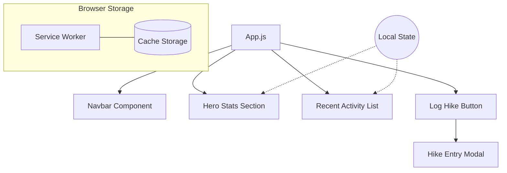

# TrailBuddy - Final Project

## Project Overview
TrailBuddy is a Progressive Web App (PWA) built with React. It is designed for hikers to track their history, view statistics, and log new trail adventures.

## Features
- **Dynamic Statistics Dashboard**: Real-time calculation of total hiking distance, elevation gain, and monthly activity counts.
- **Weather Forecast Integration**: Live weather status and hiking recommendations based on simulated or geolocation data.
- **Enhanced Hike Logging**: Track trail difficulty (Easy, Moderate, Hard) and personalized star ratings for every adventure.
- **Dashboard**: View total distance and elevation gain.
- **Log Hike**: Add new hikes via a simple form.
- **Recent Activity**: See a history of your latest trails.
- **PWA**: Can be installed on mobile devices and works offline.

## How to Run
1. Clone the repository.
2. Run `npm install`.
3. Run `npm start`.
4. Open `http://localhost:3000` in your browser.

## Technologies Used
- React.js
- Vanilla CSS
- Lucide-React (Icons)
- Service Workers (PWA)

## Project Architecture

